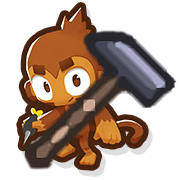
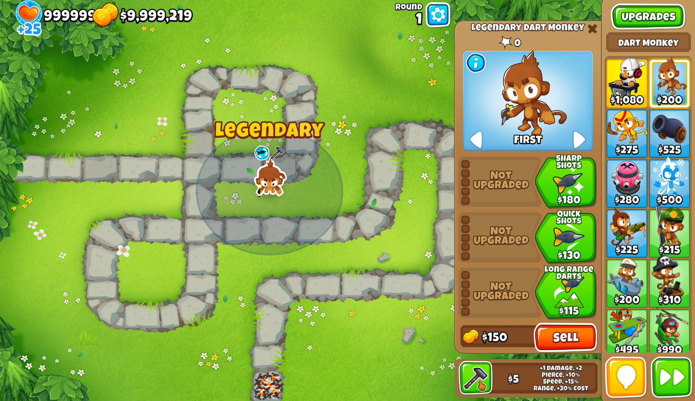

<h1 align="center">Reforge Towers</h1>

**Lets you reforge towers in a similar way to how you can reforge items in Terraria.**

Reforges can be purely positive, purely negative, or mixed, with configurable weights for each group if you want to
change how often they appear.

The price of reforging a tower is proportional to its total worth. However, reforges will also affect the costs of a
tower's available upgrades, with positive reforges making them more expensive, and negative reforges making them
cheaper.
You could decide to immediately reforge your Dart Monkey to Legendary while it's still 000 and then spend more on its
upgrades afterwards, or you could let your Dart Monkey be Shoddy while you upgrade it at a discount, and then reforge it
further at the end.
Note: for Heroes, the price multiplier is applied to XP instead.

For those familiar with Terraria, Primary towers use the prefix names for Melee weapons, Military towers use Ranged, and
Magic towers use Magic, of course. The universal prefixes are similarly shared amongst all towers + heroes.

